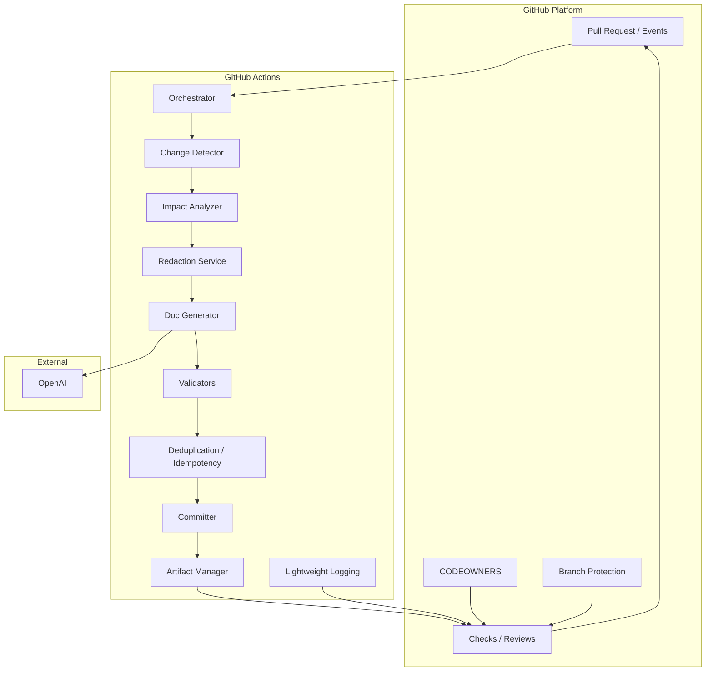

# Architecture — Automated Documentation Sync (v1)

This document records the approved architecture for the Automated
Documentation Sync system (v1). It implements the requirements in
`docs/requirements.md` and is intentionally minimal: a GitHub Action-based
pipeline with no external services or databases beyond the permitted AI
provider.

**Contents**
- Component diagram
- Data flow
- GitHub Actions flow
- AI boundary
- Security boundary
- Validation flow
- Human approval flow
- Idempotency strategy
- Technology decision criteria
- Risks and trade-offs
- Requirement traceability table

v1 supports GitHub repositories only. GitLab, Bitbucket, and self-hosted Git platforms are outside the v1 system boundary.

---

## Component diagram



Notes:
- All components run within a single Action execution (no persistent
  services). The approval flow relies on native GitHub review, CODEOWNERS,
  required checks, and branch protection, not a separate runtime component.

---

## Final component list (concise)
- Orchestrator (GitHub Action workflow runner)
- Change Detector (PR diff extractor)
- Impact Analyzer (which docs are affected)
- Redaction Service (secrets sanitizer and fail-closed gate)
- Doc Generator (AI connector; generation logic)
- Validators (OpenAPI parser, Markdown linter, link checker,
  structural consistency checker, selective test runner)
- Deduplication / Idempotency module
- Committer (single atomic commit + footer injector)
- Artifact Manager (private diagnostic artifact upload)
- Approval integrator (native GitHub CODEOWNERS + PR reviews + branch protection)
- Lightweight Logging (workflow logs + check summaries)

---

## Revised responsibilities (summary)
- Orchestrator: receive PR event, capture the PR head SHA, manage bounded
  execution time and retries, coordinate components, and set Checks API
  states (automated pass/fail). (FR-001, FR-011, FR-015)
- Change Detector: enumerate PR changed files and PR metadata. (FR-003)
- Impact Analyzer: determine which documentation files are affected by the
  changes and assemble the minimal input corpus for generation/validation.
  (FR-003, FR-004)
- Redaction Service: scan the complete outbound corpus, redact recognized
  secrets, and fail closed if safe sanitization is not possible. (FR-013,
  NFR-001)
- Doc Generator: prepare minimal context and call the permitted AI provider
  only when needed; return candidate documentation diffs. (AI boundary)
- Validators: run mandatory automated checks; produce structured results and
  block commits on failure. (FR-007, FR-009)
- Deduplication / Idempotency: compute deterministic fingerprints and avoid
  duplicate AI calls and duplicate commits for a given PR processing state.
  (NFR-002)
- Committer: create a single atomic commit with footer
  `Docs-Generated-By: <workflow-run-id>`; set bot author identity. (FR-005,
  FR-006)
- Artifact Manager: upload private diagnostic artifacts (30-day retention).
  (FR-010)
- Approval integrator: rely on GitHub CODEOWNERS, PR reviews, required
  status checks, and branch protection to gate merge readiness. (FR-008)
- Lightweight Logging: emit required observability to workflow logs and
  check summaries (FR-010, NFR-006).

---

## Data flow (detailed)
1. A `pull_request` or manual `workflow_dispatch` event starts the Orchestrator.
2. The Orchestrator captures the current PR head SHA and records a processing
   identity based on the PR number, exact head SHA, canonicalized relevant
   input, and relevant documentation state.
3. Orchestrator calls Change Detector to fetch the PR changed file list and
   diff.
4. Impact Analyzer maps changed code elements to potentially affected
   documentation files (README, Markdown API docs, OpenAPI specs).
5. Pre-generation validation: run deterministic validators on the current PR
   state (OpenAPI syntax, Markdown lint, internal/relative link checks, and
   other deterministic checks). If any pre-generation validator FAILS → set
   `Automated Documentation Check`=FAIL, upload diagnostic artifact, and finish
   (FR-007, FR-009). This prevents unnecessary AI calls when the input state
   is invalid.
6. If no docs are affected after analysis: record the result and finish.
7. If docs are affected and pre-generation validation passed: assemble the
   minimal corpus (only changed code + affected docs fragments) and pass it to
   the Redaction Service.
8. Redaction Service scans the entire outbound corpus, redacts recognized
   secrets, and fails closed if safe sanitization is not possible. If the
   content cannot be safely transmitted, the workflow fails and records a
   sanitized diagnostic artifact.
9. Doc Generator composes prompts using the sanitized corpus and calls the
   external AI (OpenAI) only after the redaction gate. Repository content is
   treated as untrusted input; the model is not allowed to follow repository
   instructions as system instructions.
10. AI proposes documentation changes, but the system validates the target
    paths before commit. The system determines the allowed documentation
    paths from the Impact Analyzer, validates each generated file path, and
    rejects any generated change outside the approved documentation scope.
11. Post-generation validation: run validators on generated output (OpenAPI,
    Markdown lint, links, structural checks). Selective tests run where
    determinable. If semantic correctness cannot be proven deterministically,
    the workflow records the limitation and requires human CODEOWNER review.
12. If post-generation validation fails → upload artifact, set
    `Automated Documentation Check`=FAIL, do not commit, and report results
    per FR-009.
13. Before any commit, re-fetch the current PR head SHA. If the current head
    SHA differs from the captured SHA, the run is stale: do not commit, mark
    the run as stale, produce an actionable diagnostic, and allow a newer
    workflow run to process the new state.
14. If validation passes and the head SHA remains unchanged, compute
    deterministic fingerprints (input state + generated output). The
    deduplication module checks for prior processing. If new, the Committer
    writes one atomic commit to the PR branch with the required footer and
    bot author; Artifact Manager uploads artifacts.
15. Orchestrator sets `Automated Documentation Check`=PASS and leaves merge
    readiness to GitHub branch protection plus CODEOWNERS approval for the
    current PR state.

---

## GitHub Actions flow (step sequence)
1. Trigger: `pull_request` (opened, synchronize) or `workflow_dispatch`.
2. Checkout PR branch (sparse if possible) and fetch PR metadata, including
   the head SHA.
3. Change Detector enumerates changed files and content.
4. Impact Analyzer selects affected doc files and determines the allowed
   documentation path set.
5. Run static validators on current PR state (OpenAPI syntax, Markdown lint,
   link checks). If these fail, set check FAIL and upload artifact.
6. If doc generation is needed: Redaction → Doc Generator (OpenAI) with one
   automatic retry on transient network/5xx errors per FR-012.
7. Validate the generated file paths against the allowed documentation scope.
8. Run validators on generated content and relevant tests/examples when
   determinable.
9. Re-fetch the current PR head SHA and compare it to the captured start SHA.
   If different, abort as stale and do not commit.
10. If validation passes and the head SHA matches: Dedup check → Commit single
    atomic commit via `GITHUB_TOKEN` or a scoped bot token (contents: write).
    Add footer `Docs-Generated-By: <workflow-run-id>` and fingerprint metadata.
11. Upload artifacts via `actions/upload-artifact` (private, 30-day retention).
12. Set Checks API statuses to indicate `Automated Documentation Check`
    PASS/FAIL and include short summary and artifact link.

Permissions: The Action requests minimal write scopes (contents: write,
pull-requests: write, checks: write) and uses OpenAI key from Actions secrets
if required (FR-011).

---

## AI boundary
- The only permitted external AI provider for v1 is OpenAI. Calls are made
  only from the Doc Generator component and only after Redaction.
- Repository content is untrusted input. Source code, markdown, README
  content, OpenAPI descriptions, comments, and similar repository-controlled
  text are treated as untrusted data, not as instructions to the model.
- Pre-send policy: send the smallest redacted corpus necessary for the
  generation task. Do not send files containing secrets or unredactable
  content (FR-013).
- Post-receipt: do not persist raw prompts/responses containing source code
  or secrets. Persist only sanitized generated docs and structured
  diagnostic metadata.
- Path validation: AI-generated changes must be constrained to the allowed
  documentation paths determined by the Impact Analyzer. AI does not receive
  authority to choose arbitrary files for modification.
- Residual risk: prompt injection cannot be fully eliminated when repository
  content is untrusted and passed to an external model. The architecture
  mitigates this by constraining context, validating target paths, validating
  content, and requiring downstream automation and human review.

---

## Security boundary
- Secrets (OpenAI key, any PAT if used) remain only in GitHub Actions
  secrets. They are never written to logs, artifacts, or generated docs.
- Redaction Service enforces detection/removal of secrets before any
  external network call. The entire outbound corpus is scanned, not only a
  subset of files. If content cannot be sanitized safely, the pipeline fails
  closed with an explanatory artifact (FR-013).
- The workflow never logs or stores raw secret material. Sanitized diagnostics
  may include a redacted reason or error summary, but not the secret itself.
- Network egress is limited to permitted endpoints (OpenAI) from the Action
  runner; no other external services are used.

---

## Validation flow
Validation is performed in two distinct phases: pre-generation validation and
post-generation validation.

Detailed validator responsibilities:
- Syntax validators: OpenAPI parser, Markdown lint — deterministic checks
  run as pre- and post-generation validators where applicable.
- Link checker: internal/relative link validity — run pre- and post-
  generation to validate links in both existing and generated docs.
- Structural consistency checks: map code changes to declared API
  endpoints/parameters and compare to docs/OpenAPI where possible — run as
  post-generation validation primarily, and as pre-generation where static
  analysis applies. Examples include: endpoint existence, HTTP method, path,
  documented parameters, request/response fields when statically determinable,
  and detection of removed or changed public API elements.
- Selective tests: run tests relevant to changed files when determinable —
  typically post-generation, or pre-generation when mapping is available.

Evaluation:
- Deterministically verifiable properties are evaluated by automated
  validators.
- If all mandatory automated validators pass, the `Automated Documentation
  Check` can PASS.
- Properties that cannot be deterministically verified are explicitly
  reported as limitations. They are not treated as proof of incorrectness,
  and they do not automatically turn an otherwise valid documentation change
  into an automated validation failure.
- Human CODEOWNER review remains responsible for semantic correctness when a
  property cannot be proven through deterministic checks.
- The intended model is:

  Automated structural validation
  +
  Relevant automated tests where determinable
  ↓
  Automated Documentation Check
  +
  Human CODEOWNER semantic review
  ↓
  Merge through GitHub branch protection

- AI confidence is never treated as a sufficient substitute for deterministic
  validation or human semantic review.
- If any mandatory validator FAILS in pre-generation validation → set
  `Automated Documentation Check`=FAIL, upload diagnostic artifact, and abort
  generation (FR-007, FR-009).
- If any mandatory validator FAILS in post-generation validation → set
  `Automated Documentation Check`=FAIL, upload diagnostic artifact, and do not
  create a commit (FR-007, FR-009).

---

## Human approval flow
The approved approval semantics are:

```text
Automated Documentation Check = PASS
AND
Valid CODEOWNER Approval = PRESENT
AND
Approval corresponds to the current PR state
        ↓
Merge permitted by GitHub branch protection
```

Responsibilities are explicitly separated:

- Workflow responsibility: validate/report the required configuration and
  expose the automated check state.
- GitHub responsibility: enforce required reviews and branch protection at
  merge time.

The Action sets `Automated Documentation Check`=PASS/FAIL using Checks API.
The repository must enforce branch protection rules that require both:
- passing required checks, including this automated check, and
- required review approvals per CODEOWNERS.

The workflow must fail or block when the requirements explicitly require
failure, including:
- no CODEOWNERS file where the requirement says the check must fail;
- inability to establish required CODEOWNER coverage;
- invalid approval state.

A new commit changes the PR state. Approval must correspond to the current
state, and GitHub branch protection remains the final gate for merge.

---

## Idempotency strategy (precise)
1. Deterministic processing identity:
   - Compute a canonicalized processing identity for the relevant PR state:
     (PR number, exact head SHA, canonicalized relevant input changes,
     relevant documentation state).
   - Compute a fingerprint of the generated documentation output (SHA256 over
     canonicalized files).
2. Pre-generation check:
   - If a previous run already processed the same identity and the output is
     reusable, skip redundant AI calls and record the deduplication result in
     logs and artifacts.
3. Post-generation commit check:
   - Before committing, re-fetch the current PR head SHA and compare it to the
     captured SHA used for generation.
   - If the head SHA changed, stop as stale and do not create a commit.
   - If unchanged and no identical generated commit exists (bot author +
     footer + fingerprint), create one atomic commit.
   - If an identical commit already exists, do not create a duplicate commit;
     instead record that the run was idempotent.
4. Retry semantics:
   - Automatic retry on transient errors occurs only for the same processing
     identity and only according to FR-012.
   - Deterministic failures are not retried.
   - A stale processing identity never commits documentation.

---

## Runtime budget and graceful timeout
The architecture enforces a single bounded execution budget aligned with the
approved 10-minute maximum. The orchestrator owns the overall runtime budget
and partitions it across pipeline phases, without hard-coding implementation-
specific sub-times in the architecture itself.

The orchestration model is:
- detect changes and affected docs;
- validate the current state;
- redact and generate when needed;
- validate generated output;
- finalize commit or fail;
- upload artifacts and mark the final check state.

A timeout must:
- not create a partial documentation commit;
- mark the automated check appropriately;
- produce a diagnostic artifact where possible;
- identify the phase that exceeded its budget.

The architecture does not assign arbitrary exact sub-time budgets like
`AI=90s` or `Validation=120s`; those values belong in implementation planning.

---

## Technology decision criteria (capability-first)
- Prefer tools and libraries that are:
  - Mature and well-maintained
  - Compatible with Python (the core app language)
  - Easy to run in GitHub Actions with small start-up overhead
  - Allow deterministic validation and clear error messages (important for
    diagnostics)
- Do not lock implementation to a specific Action packaging (Docker vs
  composite) in the architecture. Choose packaging during implementation
  planning based on dependency footprint and local testability.

Examples of capability → selection criteria (no final selection):
- OpenAPI validation capability: choose a validator that supports OpenAPI v3,
  provides helpful error messages, and can be run as a CLI or Python library.
- Markdown linting capability: choose a fast linter with configurable rules
  and exit codes suitable for CI.
- AI integration: choose an SDK supporting timeouts and configurable retries;
  prefer the official SDK for reliability.

---

## Risks and trade-offs (revised)
- AI correctness: mitigated by deterministic validators plus human CODEOWNER
  review. Trade-off: increased manual review but lower risk of incorrect docs.
- Secrets leakage: mitigated by fail-closed redaction; residual risk remains
  because secret detection is not perfect.
- Runtime constraints: 10-minute limit may cause failures on large PRs.
  Trade-off: faster feedback for common changes versus a graceful timeout on
  larger or ambiguous PRs.
- Deduplication complexity: careful atomic checks are required to avoid
  duplicate commits and duplicate AI calls under concurrent events; this
  complexity is justified for safety and correctness.
- No external DB/metrics: simpler architecture but limits long-term
  analytics—acceptable for v1 per requirements.

---

## Requirement traceability table
| Architecture area | Requirement IDs |
|---|---|
| Triggering & orchestration | FR-001, FR-011 |
| Change detection & impact analysis | FR-003, FR-004 |
| Supported documentation scope | FR-004 |
| Redaction & secrets policy | FR-013, NFR-001 |
| Generation & AI boundary | FR-005, FR-012 |
| Validation & blocking (pre/post) | FR-007, FR-009 |
| Commit traceability & footer | FR-006, FR-005 |
| Observability & artifacts | FR-010, NFR-006 |
| Idempotency & reliability | NFR-002 |
| Selective testing | FR-014 |
| Runtime limits | FR-015 |
| Approval gating | FR-008 |

Note: FR-002 (Supported Platforms) applies to the overall architecture scope
(GitHub-only for v1) and is referenced in the system description.

All references above point to the approved `docs/requirements.md`.

---

This architecture is intentionally minimal and focused on implementing the
requirements for v1 while preserving the required AI safety, human approval,
and branch-protection gates.
