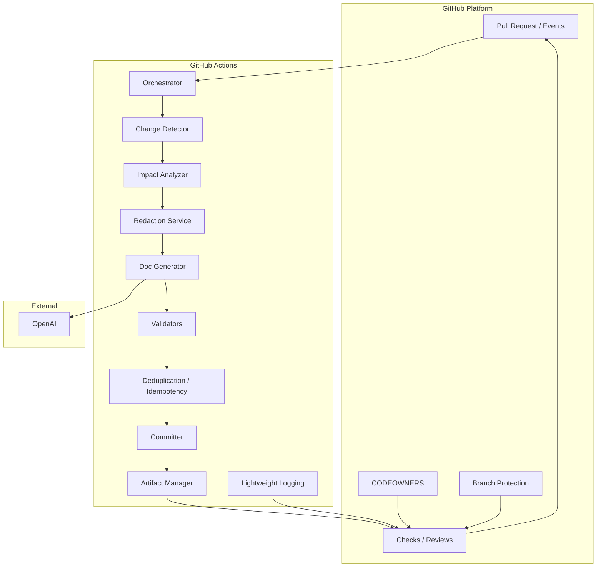

# Architecture — Automated Documentation Sync (v1)

This document records the approved architecture for the Automated
Documentation Sync system (v1). It implements the requirements in
`docs/requirements.md` and is intentionally minimal: a GitHub Action-based
pipeline with no external services or databases beyond the permitted AI
provider.

**Contents**
- Component diagram
- Data flow
- GitHub Actions flow
- AI boundary
- Security boundary
- Validation flow
- Human approval flow
- Idempotency strategy
- Technology decision criteria
- Risks and trade-offs
- Requirement traceability table

---

## Component diagram

Notes:
- All components run within a single Action execution (no persistent
  services). The Approval flow relies on native GitHub review/CODEOWNERS
  functionality, not a separate runtime component.

---

## Final component list (concise)
- Orchestrator (GitHub Action workflow runner)
- Change Detector (PR diff extractor)
- Impact Analyzer (which docs are affected)
- Redaction Service (secrets sanitizer)
- Doc Generator (AI connector; generation logic)
- Validators (OpenAPI parser, Markdown linter, link checker,
  structural consistency checker, selective test runner)
- Deduplication / Idempotency module
- Committer (single atomic commit + footer injector)
- Artifact Manager (private diagnostic artifact upload)
- Approval integrator (native GitHub CODEOWNERS + branch protection)
- Lightweight Logging (workflow logs + check summaries)

---

## Revised responsibilities (summary)
- Orchestrator: receive PR event, manage timeouts and retries, coordinate
  components, set Checks API states (automated pass/fail). (FR-001, FR-011,
  FR-015)
- Change Detector: enumerate PR changed files and PR metadata. (FR-003)
- Impact Analyzer: determine which documentation files are affected by the
  changes and assemble the minimal input corpus for generation/validation.
  (FR-003, FR-004)
- Redaction Service: detect and redact secrets; fail if unable to
  sanitize safely. (FR-013, NFR-001)
- Doc Generator: prepare minimal context and call permitted AI provider
  only when needed; return candidate documentation diffs. (AI boundary)
- Validators: run mandatory automated checks; produce structured results
  and block commits on failure. (FR-007, FR-009)
- Deduplication / Idempotency: compute deterministic fingerprints and
  avoid duplicate AI calls and duplicate commits. (NFR-002)
- Committer: create a single atomic commit with footer
  `Docs-Generated-By: <workflow-run-id>`; set bot author identity. (FR-005,
  FR-006)
- Artifact Manager: upload private diagnostic artifacts (30-day retention).
  (FR-010)
- Approval integrator: rely on GitHub CODEOWNERS, PR reviews, and branch
  protection to gate merge readiness (FR-008).
- Lightweight Logging: emit required observability to workflow logs and
  check summaries (FR-010, NFR-006).

---

## Data flow (detailed)
1. A `pull_request` or manual `workflow_dispatch` event starts the Orchestrator.
2. Orchestrator calls Change Detector to fetch the PR changed file list and
  diff.
3. Impact Analyzer maps changed code elements to potentially affected
  documentation files (README, Markdown API docs, OpenAPI specs).
4. Pre-generation validation: run deterministic validators on the current PR
  state (OpenAPI syntax, Markdown lint, internal/relative link checks, and
  other deterministic checks). If any pre-generation validator FAILS → set
  `Automated Documentation Check`=FAIL, upload diagnostic artifact, and
  finish (FR-007, FR-009). This prevents unnecessary AI calls when the
  input state is invalid.
5. If no docs are affected after analysis: record `automated documentation
  check` PASS/FAIL and finish.
6. If docs are affected and pre-generation validation passed: assemble the
  minimal corpus (only changed code + affected docs fragments) and pass to
  the Redaction Service.
7. Redaction Service attempts to sanitize sensitive data; on success pass
  the sanitized corpus to Doc Generator. On failure, abort with artifact.
8. Doc Generator composes prompts using the sanitized corpus and calls the
  external AI (OpenAI). The generated candidate docs/diffs are returned.
9. Post-generation validation: run validators on generated output (OpenAPI,
  Markdown lint, links, structural checks). Selective tests run where
  determinable. If post-generation validators FAIL → upload artifact, set
  `Automated Documentation Check`=FAIL, do not commit (FR-007), and report
  results per FR-009; finish.
10. If post-generation validators PASS: compute deterministic fingerprints
   (input state + generated output). Deduplication module checks for prior
   processing. If new, Committer writes one atomic commit to the PR branch
   with the required footer and bot author; Artifact Manager uploads
   artifacts.
11. Orchestrator sets `Automated Documentation Check`=PASS and leaves the
   PR in `Required CODEOWNER Review`=PENDING state. Human CODEOWNER review
   must then approve via native GitHub review to satisfy merge readiness.

---

## GitHub Actions flow (step sequence)
1. Trigger: `pull_request` (opened, synchronize) or `workflow_dispatch`.
2. Checkout PR branch (sparse if possible) and fetch PR metadata.
3. Change Detector enumerates changed files and content.
4. Impact Analyzer selects affected doc files.
5. Run static validators on current PR state (OpenAPI syntax, Markdown lint,
   link checks). If these fail, set check FAIL and upload artifact.
6. If doc generation needed: Redaction → Doc Generator (OpenAI) with one
   automatic retry on transient network/5xx errors (FR-012).
7. Run validators on generated content and selective tests.
8. If validation passes: Dedup check → Commit single atomic commit via
   `GITHUB_TOKEN` or a scoped bot token (contents: write). Add footer
   `Docs-Generated-By: <workflow-run-id>` and fingerprint metadata.
9. Upload artifacts via `actions/upload-artifact` (private, 30-day retention).
10. Set Checks API statuses to indicate `Automated Documentation Check`
    PASS/FAIL and include short summary and artifact link. Leave human
    approval state to GitHub reviews/CODEOWNERS.

Permissions: Action requests minimal write scopes (contents: write,
pull-requests: write, checks: write) and uses OpenAI key from Actions secrets
if required (FR-011).

---

## AI boundary
- The only permitted external AI provider for v1 is OpenAI. Calls are only
  made from the Doc Generator component and only after Redaction.
- Pre-send policy: send the smallest redacted corpus necessary for the
  generation task. Do not send files containing secrets or unredactable
  content (FR-013).
- Post-receipt: do not persist raw prompts/responses containing source code
  or secrets. Persist only sanitized generated docs and structured
  diagnostic metadata.

---

## Security boundary
- Secrets (OpenAI key, any PAT if used) remain only in GitHub Actions
  secrets. They are never written to logs, artifacts, or generated docs.
- Redaction Service enforces detection/removal of secrets before any
  external network call. If content cannot be sanitized, the pipeline fails
  with an explanatory artifact (FR-013).
- Network egress limited to permitted endpoints (OpenAI) from the Action
  runner; no other external services are used.

---

## Validation flow
Validation is performed in two distinct phases as described above: pre-
generation validation and post-generation validation. See the Data Flow
section for where each phase is executed in the pipeline.

Detailed validator responsibilities:
- Syntax validators: OpenAPI parser, Markdown lint — deterministic checks
  run as pre- and post-generation validators where applicable.
- Link checker: internal/relative link validity — run pre- and post-
  generation to validate links in both existing and generated docs.
- Structural consistency checks: map code changes to declared API
  endpoints/parameters and compare to docs/OpenAPI where possible — run as
  post-generation validation primarily, and as pre-generation where static
  analysis applies.
- Selective tests: run tests relevant to changed files when determinable —
  typically post-generation, or pre-generation when mapping is available.

Evaluation:
- If any mandatory validator FAILS in pre-generation validation → set
  `Automated Documentation Check`=FAIL, upload diagnostic artifact, and
  abort generation (FR-007, FR-009).
- If any mandatory validator FAILS in post-generation validation → set
  `Automated Documentation Check`=FAIL, upload diagnostic artifact, and do
  not create a commit (FR-007, FR-009).
- If all mandatory validators PASS in post-generation validation → set
  `Automated Documentation Check`=PASS and proceed to deduplication and
  commit stage.

---

## Human approval flow
- The Action sets `Automated Documentation Check`=PASS/FAIL using Checks API.
- The repository must enforce branch protection rules that require:
  - Passing required checks (including this automated check) and
  - Required review approvals per CODEOWNERS.
- Only a CODEOWNERS review approval satisfies the `Required CODEOWNER
  Review` condition (APPROVED/PENDING). Merge readiness is achieved only
  when both automated PASS and CODEOWNERS APPROVED are present (FR-008).

---

## Idempotency strategy (precise)
1. Deterministic fingerprint calculation:
   - Compute a canonicalized fingerprint of the PR input state relevant to
     doc generation: (PR number, head commit SHA, normalized diffs of
     changed code fragments, normalized content of affected doc files,
     relevant OpenAPI spec fragments). Canonicalization normalizes
     whitespace and ordering where possible.
   - Compute a fingerprint of the generated documentation output (SHA256
     over canonicalized files).
2. Pre-generation check:
   - If a previous run artifact or existing commit on the PR branch contains
     the same input-state fingerprint, skip calling the AI and reuse prior
     results (or deduplicate). Record deduplication in artifact and logs.
3. Post-generation commit check:
   - Before committing, re-fetch branch head and ensure the input-state has
     not changed; recompute fingerprint. If unchanged and no identical
     generated commit exists (bot author + footer + fingerprint), create
     one atomic commit.
   - If an identical commit already exists, do not create a duplicate
     commit; instead record that the run was idempotent.
4. Retry semantics:
   - Automatic retry on transient errors does not re-create commits because
     deduplication checks are performed prior to commit creation. (FR-012,
     NFR-002)

---

## Technology decision criteria (capability-first)
- Prefer tools and libraries that are:
  - Mature and well-maintained
  - Compatible with Python (the core app language)
  - Easy to run in GitHub Actions with small start-up overhead
  - Allow deterministic validation and clear error messages (important for
    diagnostics)
- Do not lock implementation to a specific Action packaging (Docker vs
  composite) in the architecture. Choose packaging during implementation
  planning based on dependency footprint and local testability.

Examples of capability → selection criteria (no final selection):
- OpenAPI validation capability: choose a validator that supports
  OpenAPI v3, provides helpful error messages, and can be run as a CLI or
  Python library.
- Markdown linting capability: choose a fast linter with configurable rules
  and exit codes suitable for CI.
- AI integration: choose an SDK supporting timeouts and configurable
  retries; prefer official SDK for reliability.

---

## Risks and trade-offs (revised)
- AI correctness: mitigated by validators + CODEOWNERS review. Trade-off:
  increased manual review but lower risk of incorrect docs.
- Secrets leakage: mitigated by Redaction Service; residual risk if
  redaction misses novel secret patterns.
- Runtime constraints: 10-minute limit may cause failures on large PRs.
  Trade-off: faster feedback for common changes vs inability to handle
  very large merges in v1.
- Deduplication complexity: careful atomic checks required to avoid
  duplicates under concurrent events; complexity justified to prevent
  duplicate commits and double AI usage.
- No external DB/metrics: simpler architecture but limits long-term
  analytics—acceptable for v1 per requirements.

---

## Requirement traceability table
| Architecture area | Requirement IDs |
|---|---|
| Triggering & orchestration | FR-001, FR-011 |
| Change detection & impact analysis | FR-003, FR-004 |
| Supported documentation scope | FR-004 |
| Redaction & secrets policy | FR-013, NFR-001 |
| Generation & AI boundary | FR-005, FR-012 |
| Validation & blocking (pre/post) | FR-007, FR-009 |
| Commit traceability & footer | FR-006, FR-005 |
| Observability & artifacts | FR-010, NFR-006 |
| Idempotency & reliability | NFR-002 |
| Selective testing | FR-014 |
| Runtime limits | FR-015 |
| Approval gating | FR-008 |

Note: FR-002 (Supported Platforms) applies to the overall architecture
scope (GitHub-only for v1) and is referenced in the system description.

All references above point to the approved `docs/requirements.md`.

---

This architecture is intentionally minimal and focused on implementing the
requirements for v1. If you approve this version, I'll finalize any
implementation planning artifacts and CI skeletons on request.
