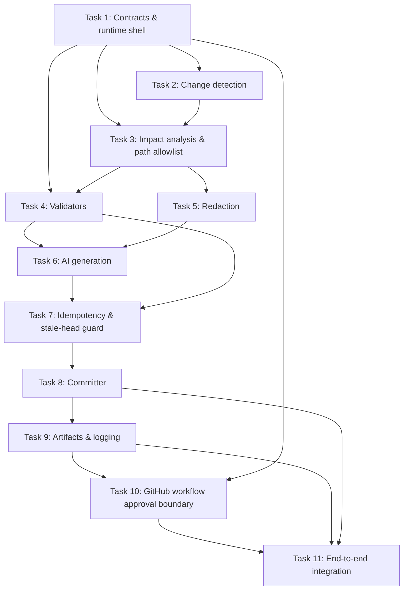

# Implementation Plan — Automated Documentation Sync

## 1. Implementation Strategy

This implementation plan converts the approved architecture into a dependency-ordered, testable Phase 6 build plan for the GitHub-only documentation synchronization workflow.

The implementation should proceed in layered stages rather than as one monolithic feature:

1. Establish stable contracts and shared primitives.
2. Implement change detection and impact analysis against the PR diff.
3. Implement deterministic validation and fail-closed redaction behavior.
4. Implement the AI generation boundary with strict path validation.
5. Add idempotency, stale-head rejection, and commit safety.
6. Complete GitHub workflow orchestration, artifact handling, and check states.
7. Finish end-to-end verification and operational diagnostics.

The design intentionally stays within a single Action-based pipeline and does not introduce persistent infrastructure, queues, databases, or custom approval-monitor services. The work is organized around the approved component boundaries: Orchestrator, Change Detector, Impact Analyzer, Redaction Service, Doc Generator, Validators, Deduplication / Idempotency, Committer, Artifact Manager, GitHub approval integration, and Lightweight Logging.

---

## 2. Implementation Architecture

The architecture is implemented as a single Python-based GitHub Action runtime with a small set of focused modules. Each component is responsible for one stage of the workflow and communicates through deterministic data contracts rather than through hidden side effects.

| Component | Planned module(s) | Responsibility |
| --- | --- | --- |
| Orchestrator | src/doc_sync/orchestrator.py | Entry point; captures PR head SHA; manages phase budgets; coordinates workflow state |
| Change Detector | src/doc_sync/detector.py | Lists changed files and extracts PR metadata and diff data |
| Impact Analyzer | src/doc_sync/analyzer.py | Maps code/API changes to likely documentation impact and allowed doc paths |
| Redaction Service | src/doc_sync/redactor.py | scans outbound corpus, redacts secrets, fails closed |
| Doc Generator | src/doc_sync/generator.py | prepares prompts, calls OpenAI, validates generated path set |
| Validators | src/doc_sync/validator.py | runs structural validators, lint, links, and relevant tests |
| Deduplication / Idempotency | src/doc_sync/idempotency.py | computes processing identity, dedupe keys, stale-head checks |
| Committer | src/doc_sync/committer.py | creates atomic documentation commit with required footer |
| Artifact Manager | src/doc_sync/artifacts.py | collects diagnostics and uploads private artifact bundle |
| GitHub integration | src/doc_sync/github_client.py | PR metadata, checks, review metadata, branch protection semantics |
| Lightweight Logging | src/doc_sync/logging.py | emits structured logs and summaries |
| Shared contracts | src/doc_sync/models.py | shared dataclasses / typed payloads |

This remains faithful to the approved architecture and keeps all work within the GitHub Actions execution model.

---

## 3. Proposed Repository Structure

```text
.github/
  workflows/
    documentation-sync.yml

src/
  doc_sync/
    __init__.py
    models.py
    orchestrator.py
    detector.py
    analyzer.py
    redactor.py
    generator.py
    validator.py
    idempotency.py
    committer.py
    artifacts.py
    github_client.py
    logging.py
    cli.py

tests/
  test_detector.py
  test_analyzer.py
  test_validator.py
  test_redactor.py
  test_generator.py
  test_idempotency.py
  test_committer.py
  test_orchestrator.py
  test_workflow_integration.py

sample-project/
  docs/
  src/

README.md
docs/
  requirements.md
  architecture.md
  design-review.md
  imp-plan.md
```

This structure keeps implementation modular without introducing any non-approved runtime services.

---

## 4. Domain Contracts and Data Models

The implementation must use explicit, deterministic contracts for data exchange among components.

### PRContext
- `repo`, `owner`, `pr_number`, `head_sha`, `base_sha`, `event_name`, `workflow_run_id`
- captured once at workflow start for stale-run decisions

### ChangedFile
- `path`
- `status` (`added`, `modified`, `deleted`, `renamed`)
- `diff_hunk` / normalized content summary
- `kind` (`code`, `docs`, `openapi`, `config`, `unknown`)

### ImpactAnalysis
- `changed_files`
- `affected_docs`
- `allowed_doc_paths`
- `reasoning` / confidence summary for humans and logs
- `requires_generation` boolean

### GenerationRequest
- `pr_context`
- `input_corpus`
- `affected_doc_paths`
- `redacted_corpus`
- `processing_identity`

### ValidationResult
- `phase` (`pre_generation` or `post_generation`)
- `status` (`pass` or `fail`)
- `errors` / `warnings`
- `deterministic` boolean
- `limitations` list

### RedactionResult
- `status` (`redacted`, `blocked`, `not_required`)
- `redacted_files`
- `secret_count`
- `blocked_reason` when fail-closed

### ProcessingIdentity
- `pr_number`
- `head_sha`
- `canonical_input_fingerprint`
- `relevant_doc_state_fingerprint`
- `derived_key` for dedupe and stale-run checks

### CommitPlan
- `branch`, `base_sha`, `head_sha`, `files_to_update`, `message`, `footer`, `bot_identity`

### ArtifactBundle
- `workflow_run_id`
- `pr_number`
- `head_sha`
- `duration_seconds`
- `ai_calls`
- `retry_count`
- `changed_files`
- `affected_docs`
- `validation_status`
- `final_check_state`
- `failure_reason` or `stale_reason`

These structures must be stable enough for tests while remaining implementation-neutral.

---

## 5. Implementation Tasks

### TASK-001 — Shared Contracts, Configuration, and Runtime Shell

Objective
- Define the shared types, config schema, and runtime shell that all action phases use.

Why
- Every downstream component depends on a stable contract model and avoid hidden coupling.

Dependencies
- None

Files / Modules
- src/doc_sync/models.py
- src/doc_sync/logging.py
- src/doc_sync/__init__.py
- .github/workflows/documentation-sync.yml (workflow wiring, not implementation logic)

Implementation Details
- Create typed payloads for PR state, validation results, redaction output, artifact metadata, and commit plans.
- Define config categories for secrets, workflow inputs, GitHub token scopes, and runtime environment.
- Establish canonical error classification and structured log fields.
- Ensure the runtime shell keeps execution bounded and deterministic.

Interfaces / Contracts
- `PRContext`, `ValidationResult`, `RedactionResult`, `ProcessingIdentity`, `CommitPlan`, `ArtifactBundle`

Error Handling
- Invalid configuration should fail early with a sanitized diagnostic.
- Missing required workflow inputs should be classified as configuration failure, not AI output failure.

Security Considerations
- No secrets in config files; only env or GitHub Actions secret references.

Tests
- Unit tests for model serialization, config defaults, and failure classification.
- Integration tests that validate environment binding in CI-like execution.

Acceptance Criteria
- All downstream modules import the same contract shapes.
- Config and runtime state can be validated without ambiguous types.

Requirement Traceability
- FR-010, FR-011, NFR-004, NFR-006

Architecture Traceability
- Orchestrator, Lightweight Logging, shared contracts

Design Review Traceability
- DR-008 (diagnostic categories), DR-006 (runtime shell)

---

### TASK-002 — Change Detection and PR Metadata Extraction

Objective
- Capture changed files, diff metadata, and PR state required for subsequent analysis.

Why
- The workflow must operate only on the relevant changed files and must not process unrelated repository content.

Dependencies
- TASK-001

Files / Modules
- src/doc_sync/detector.py
- tests/test_detector.py

Implementation Details
- Fetch changed files from the PR payload or GitHub API.
- Normalize file states and classify them by kind: docs, code, API schema, config, or unknown.
- Capture the PR head SHA and base SHA at start to support stale-run checks.
- Produce a minimal changed-file inventory for the rest of the pipeline.

Interfaces / Contracts
- `detect_changes(pr_context) -> list[ChangedFile]`

Error Handling
- Unparseable diff payloads should fail the check and record the failure reason.

Security Considerations
- No repository content is modified here; only metadata extraction occurs.

Tests
- Unit tests for file classification and diff extraction.
- Integration tests with sample PR payloads.

Acceptance Criteria
- The detector returns the relevant changed files and metadata without broad repository scanning.

Requirement Traceability
- FR-001, FR-003, FR-014, FR-015

Architecture Traceability
- Change Detector

Design Review Traceability
- DR-001 (capture head SHA), DR-007 (processing identity)

---

### TASK-003 — Impact Analyzer and Allowed Documentation Scope

Objective
- Determine the documentation files likely affected by the PR and the approved set of documentation paths.

Why
- This defines the safe generation scope and prevents arbitrary file edits.

Dependencies
- TASK-001, TASK-002

Files / Modules
- src/doc_sync/analyzer.py
- tests/test_analyzer.py

Implementation Details
- Map changed code/API elements to likely doc targets such as README, API Markdown, and OpenAPI files.
- Produce `allowed_doc_paths` as the exact set that may be modified.
- Exclude source code, workflow files, tests, config files, and arbitrary files from the write scope.
- Distinguish no-op documentation changes from actual doc generation needs.

Interfaces / Contracts
- `analyze_impact(changed_files, repo_state) -> ImpactAnalysis`

Error Handling
- If the analyzer cannot resolve a safe write scope, it should fail without invoking AI generation.

Security Considerations
- Path allowlist must be enforced before any generated change is considered for commit.

Tests
- Unit tests for mapping changed endpoints to doc files.
- Negative tests for disallowed file targets.

Acceptance Criteria
- Only approved documentation files can be returned in the generation scope.

Requirement Traceability
- FR-003, FR-004, FR-014, FR-015

Architecture Traceability
- Impact Analyzer, allowed path boundary

Design Review Traceability
- DR-003 (documented path allowlist), DR-004 (deterministic structural checks)

---

### TASK-004 — Deterministic Validators and Pre/Post Validation Pipeline

Objective
- Implement the automated validation pipeline that blocks invalid documentation before commit.

Why
- Validators are the core safety gate: they ensure the generated docs are structurally valid and match the relevant contract where determinable.

Dependencies
- TASK-001, TASK-003

Files / Modules
- src/doc_sync/validator.py
- tests/test_validator.py

Implementation Details
- Implement deterministic checks for OpenAPI syntax, Markdown lint, internal/relative links, structural consistency, and relevant tests/examples where determinable.
- Define `pre_generation` and `post_generation` phases.
- Record limitations explicitly when a property cannot be proven deterministically.
- Keep automated validation separate from human semantic review.

Interfaces / Contracts
- `run_validators(phase, pr_context, corpus, impacted_docs) -> ValidationResult`

Error Handling
- Validation failures cause a failed check and block commit.
- Limitations are recorded in structured metadata, not treated as proof of failure.

Security Considerations
- Validation must not execute arbitrary repository instructions; it should only evaluate repo content and generated docs.

Tests
- Unit tests for each validator.
- Integration tests for pass/fail cases and limitation handling.
- Failure-path tests for malformed OpenAPI and broken links.

Acceptance Criteria
- Invalid docs fail the check before commit.
- Deterministic validation passes do not imply semantic correctness; they enable “Automated Documentation Check = PASS” while human review remains required.

Requirement Traceability
- FR-007, FR-009, FR-014, FR-015, NFR-008

Architecture Traceability
- Validators, Validation flow, Human approval flow

Design Review Traceability
- DR-004, DR-006

---

### TASK-005 — Fail-Closed Redaction Service

Objective
- Ensure the entire outbound AI corpus is scanned and sanitized before any AI transmission.

Why
- Secret handling is a fail-closed security boundary and must never allow raw secrets to leave the repository context.

Dependencies
- TASK-001, TASK-003

Files / Modules
- src/doc_sync/redactor.py
- tests/test_redactor.py

Implementation Details
- Apply redaction to the complete outbound corpus, not selectively to some files.
- Detect known secret categories from FR-013 and redact them when possible.
- If safe sanitization is not possible, block the AI call, fail the automated check, and record sanitized diagnostic output.
- Do not log or persist raw secret values.

Interfaces / Contracts
- `redact_corpus(corpus) -> RedactionResult`

Error Handling
- If redaction fails or a secret candidate remains unredacted, the workflow aborts and reports a sanitized limitation.

Security Considerations
- Fail-closed boundary; no raw secret logging; no secret artifact content; no external AI call on unsafe content.

Tests
- Unit tests for secret detection and masking.
- Negative tests for unredactable secrets.
- Security tests for edge cases and false positives on ordinary email/IP patterns.

Acceptance Criteria
- No outbound AI request is sent when the safe-redaction requirement is violated.

Requirement Traceability
- FR-013, NFR-001, NFR-007, NFR-008

Architecture Traceability
- Redaction Service, Security boundary, AI boundary

Design Review Traceability
- DR-005

---

### TASK-006 — AI Doc Generator Boundary

Objective
- Generate candidate documentation edits from the redacted corpus and return them for deterministic validation and commit gating.

Why
- The generator is a constrained AI boundary, not a validator and not the final authority on correctness.

Dependencies
- TASK-003, TASK-004, TASK-005

Files / Modules
- src/doc_sync/generator.py
- tests/test_generator.py

Implementation Details
- Prepare the minimal redacted prompt based on affected files and existing docs.
- Invoke the AI client only after redaction and repository-scope validation are complete.
- The generator is responsible for:
  - prompt/request construction;
  - AI invocation;
  - timeout/retry classification according to FR-012;
  - parsing the AI response;
  - returning candidate documentation changes.
- The generator is not responsible for semantic validation, Markdown lint, OpenAPI validation, link validation, or final documentation correctness.
- Immediately after generation, enforce generated path allowlist validation against the approved documentation scope.
- Treat repository-controlled text as untrusted input and never allow the AI to redefine workflow instructions or choose arbitrary paths.

Interfaces / Contracts
- `generate_docs(request: GenerationRequest) -> list[GeneratedDoc]`

Error Handling
- Transient network failures and HTTP 5xx responses receive one automatic retry only when the same processing identity is still valid.
- Authentication failures, malformed requests, and invalid input are deterministic failures and do not retry.
- Timeout handling is bounded by the 10-minute workflow budget and does not automatically retry unless the implementation can demonstrate a transient network condition within the approved retry semantics; the run still must fail without commit if timeout is reached.
- Invalid generated paths trigger fail-closed rejection without commit.

Security Considerations
- Prompt injection mitigation, path allowlist enforcement, no arbitrary file writes, no raw prompt/response persistence.

Tests
- Unit tests for prompt construction and response parsing.
- Unit tests for path validation gating.
- Negative tests for prompt-injection attempts and out-of-scope path generation.
- Failure tests for timeout classification, transient retry handling, 5xx retry, authentication rejection, and invalid request handling.

Acceptance Criteria
- AI output cannot modify files outside the approved documentation scope.
- The generator returns candidate changes only; deterministic post-generation validation remains the responsibility of the Validators layer.
- AI remains non-authoritative and requires post-generation validation plus human review.

Requirement Traceability
- FR-005, FR-012, FR-013, NFR-008

Architecture Traceability
- Doc Generator, AI boundary, Security boundary

Design Review Traceability
- DR-003, DR-005, DR-007

---

### TASK-007 — Idempotency, Stale-Head Protection, and Processing Identity

Objective
- Prevent duplicate AI calls, duplicate documentation commits, and stale commits using a GitHub-native dedupe and revalidation mechanism that does not introduce a database, queue, cache service, or persistent external state.

Why
- Concurrency and stale-state races are the highest-risk correctness issues in the workflow. The system must be able to deterministically recognize prior successful processing for the same PR state and reject any old branch state before commit.

Dependencies
- TASK-001, TASK-002, TASK-006

Files / Modules
- src/doc_sync/idempotency.py
- tests/test_idempotency.py

Implementation Details
- Compute the approved processing identity from:
  - PR number;
  - exact PR head SHA;
  - canonical relevant input;
  - relevant documentation state.
- Use the PR branch history and GitHub commit metadata as the repository-native dedupe source of truth. A successful doc run records a deterministic fingerprint in the documentation commit metadata (for example, in the commit message footer and/or a generated-document metadata marker retained in the generated doc scope as allowed by the architecture).
- The dedupe check works as follows:
  1. compute the processing identity for the current run;
  2. inspect the latest successful documentation commit(s) reachable from the PR branch for the same PR number and the same processing identity fingerprint;
  3. if the same processing identity is already represented by a successful documentation commit on the current PR head, skip redundant AI generation and skip a second docs commit as idempotent;
  4. if the PR head SHA changed after capture, reject the run as stale immediately before the commit step;
  5. if the processing identity differs from the current PR head but the same relevant input was already processed on an older SHA, treat it as a new run and do not reuse the older result.
- The workflow must not use a database, queue, or external cache. The only state used is the GitHub PR branch commit history and metadata already available in the repository.

Interfaces / Contracts
- `compute_processing_identity(pr_context, affected_docs, changes) -> ProcessingIdentity`
- `resolve_existing_successful_processing(pr_context, processing_identity) -> Optional[ExistingDocCommit]`
- `is_stale_run(current_head_sha, captured_head_sha) -> bool`

Error Handling
- Stale runs are marked as stale and fail without creating a docs commit.
- Duplicate processing is handled as idempotent completion; it does not call the AI again and does not create a duplicate commit.
- If a later commit appears after generation but before commit, the stale-head check aborts without commit and records the reason.

Security Considerations
- No unauthorized commit on outdated state; stale state is rejected before commit.
- No persistent service or approval bypass is added.

Tests
- Unit tests for processing identity stability and canonicalization.
- Concurrency tests for stale-head and duplicate processing across near-simultaneous runs.
- Integration tests simulating a new push between generation and commit.

Acceptance Criteria
- A stale workflow never commits documentation generated from an earlier PR state.
- Duplicate AI calls are skipped when the same processing identity has already been handled successfully on the branch.
- Duplicate documentation commits are prevented.

Requirement Traceability
- FR-001, FR-005, FR-012, NFR-002

Architecture Traceability
- Deduplication / Idempotency, stale head validation

Design Review Traceability
- DR-001, DR-007

---

### TASK-008 — Committer, Commit Safety, and Footer Injection

Objective
- Commit a single atomic documentation update only after final validation and stale-head checks pass.

Why
- Commit safety is required to ensure only validated documentation changes are merged to the PR branch.

Dependencies
- TASK-004, TASK-006, TASK-007

Files / Modules
- src/doc_sync/committer.py
- tests/test_committer.py

Implementation Details
- Build the commit payload from validated files only.
- Ensure the commit only modifies the approved documentation scope.
- Inject the required footer `Docs-Generated-By: <workflow-run-id>`.
- Use the bot identity required by the repository policy.
- Require final head-SHA equality before commit creation.

Interfaces / Contracts
- `prepare_commit(plan: CommitPlan, validation_result, pr_context) -> CommitPlan`
- `write_atomic_commit(commit_plan) -> commit_summary`

Error Handling
- Commit failures are reported with sanitized diagnostics and a failed check result.
- No partial doc commit is allowed.

Security Considerations
- The commit boundary must reject any attempt to include non-approved files or generated content outside path scope.

Tests
- Unit tests for footer injection and path filtering.
- Integration tests for atomic commit success and failure.

Acceptance Criteria
- A successful commit includes only approved documentation changes and the required footer.
- No commit happens after timeout, validation failure, or stale PR state.

Requirement Traceability
- FR-005, FR-006, FR-007, and FR-009 are the relevant requirement checks for this task

Architecture Traceability
- Committer, Artifact Manager, final commit flow

Design Review Traceability
- DR-001, DR-003, DR-007

---

### TASK-009 — Artifact Manager, Logging, and Check Summaries

Objective
- Produce private diagnostic artifacts and clear check summaries for each run.

Why
- Observability and diagnostics are required for failure reporting, traceability, and operational support.

Dependencies
- TASK-001, TASK-004, TASK-007, TASK-008

Files / Modules
- src/doc_sync/artifacts.py
- src/doc_sync/logging.py
- tests/test_workflow_integration.py

Implementation Details
- Record workflow run ID, duration, AI calls, retry count, changed files, affected docs, validation status, head SHA, final check state, and commit metadata when applicable.
- Store private artifacts with 30-day retention.
- Keep the artifact schema implementation-neutral at the architecture layer but structured at the implementation layer.
- Emit workflow logs and a concise PR summary.

Interfaces / Contracts
- `publish_artifact(bundle: ArtifactBundle) -> artifact_uri`
- `emit_summary(run_result) -> check_summary`

Error Handling
- Artifact upload failures are surfaced as workflow failure without creating partial doc commits.

Security Considerations
- Do not include secrets in logs or artifacts.

Tests
- Integration tests for artifact contents and retention classification.
- Failure-path tests for upload failure.

Acceptance Criteria
- Each run produces a private artifact and the required summary metadata.
- Failures, stale runs, and commits are explainable from logs and artifacts.

Requirement Traceability
- FR-006, FR-009, FR-010, NFR-006, NFR-007

Architecture Traceability
- Artifact Manager, Lightweight Logging

Design Review Traceability
- DR-008

---

### TASK-010 — GitHub Workflow Orchestration and Native Approval Boundary

Objective
- Implement the workflow as a GitHub-native execution and reporting layer that produces pass/fail check outcomes while leaving approval and merge enforcement to GitHub itself.

Why
- The architecture explicitly separates workflow monitoring from repository approval enforcement. The workflow must not replace GitHub branch protection or build a custom approval engine.

Dependencies
- TASK-001 through TASK-009

Files / Modules
- .github/workflows/documentation-sync.yml
- src/doc_sync/github_client.py
- src/doc_sync/orchestrator.py

Implementation Details
- Implement triggers for `pull_request` and manual execution.
- Capture the checkout state and PR metadata, including head SHA.
- Set the automated check state as PASS/FAIL.
- Validate repository configuration for CODEOWNERS and required review semantics, and fail the workflow if required config is missing or invalid.
- Workflow responsibility:
  - produce Automated Documentation Check PASS/FAIL;
  - validate/report required repository configuration where appropriate.
- GitHub responsibility:
  - CODEOWNERS review;
  - required review approvals;
  - branch protection;
  - final merge enforcement.
- A valid CODEOWNER approval must correspond to the current PR state. If the PR head changes after approval, the approval is invalid according to native GitHub semantics and the workflow must treat the state as stale/invalid for documentation commit readiness.
- No custom approval monitor or custom merge gate is introduced.

Interfaces / Contracts
- `check_pr_approval_state(pr_context) -> approval_status`
- `set_check_status(status, summary, artifact_link)`

Error Handling
- Missing CODEOWNERS or invalid review configuration must fail the workflow with a sanitized diagnostic.
- A state mismatch between approval and current PR head must be treated as invalid and must not allow commit.

Security Considerations
- No automatic merge; no approval bypass; workflow does not replace GitHub branch protection.

Tests
- GitHub workflow tests with PR event payloads.
- Negative tests for missing CODEOWNERS and stale approval states.
- Validation that the workflow passes or fails based on GitHub-native state, not custom approval logic.

Acceptance Criteria
- Merge remains gated by GitHub branch protection and valid CODEOWNER review for the current PR state.
- The workflow reports status and configuration issues without emulating or replacing GitHub approval enforcement.

Requirement Traceability
- FR-001, FR-008, FR-011, FR-015

Architecture Traceability
- Orchestrator, Approval integrator, GitHub Platform boundary

Design Review Traceability
- DR-002, DR-004

---

### TASK-011 — End-to-End Integration and Final Verification

Objective
- Validate the complete workflow as a single integration harness and confirm all safety gates behave correctly from PR event through check status and artifact publication.

Why
- The pipeline must work end-to-end without hidden assumptions, especially around stale heads, duplicate processing, AI safety, and the GitHub-native approval boundary.

Dependencies
- TASK-001 through TASK-010

Files / Modules
- tests/test_workflow_integration.py
- sample-project/ (scenario fixtures)

Implementation Details
- Run the workflow end-to-end on representative PR scenarios:
  - code change with doc impact,
  - code change without doc impact,
  - documentation-only PR with no externally visible code/API change and no forced documentation generation,
  - doc generation failure,
  - validation failure,
  - stale PR head,
  - duplicate processing,
  - secret block,
  - missing CODEOWNERS.
- Documentation-only PR behavior:
  - no externally visible code/API change;
  - no forced documentation generation;
  - no generated documentation commit;
  - applicable lint/link validation may still run but it must not trigger a documentation generation commit.
- Validate outputs, checks, and artifacts, including the final commit and stale-head enforcement.

Interfaces / Contracts
- End-to-end harness over repository fixtures and GitHub-like event payloads.

Error Handling
- Failures must surface as expected check state and artifact diagnostics.
- Artifact publication failures must not cause a second documentation commit or unsafe rollback.

Security Considerations
- No raw secret emission; all tests must assert sanitization behavior.

Tests
- Full workflow integration tests plus a subset of GitHub Actions end-to-end smoke tests.
- Scenario tests for documentation-only PRs and artifact upload-after-commit failures.

Acceptance Criteria
- The full system passes the agreed scenarios without violating architecture constraints.
- Documentation-only PRs do not force a generated doc commit.
- A commit can succeed while artifact publication fails without triggering a duplicate remediation commit or unsafe rollback.

Requirement Traceability
- FR-001, FR-005, FR-007, FR-008, FR-009, FR-010, FR-011, FR-012, FR-013, FR-014, FR-015, NFR-001, NFR-002, NFR-003, NFR-006, NFR-007, NFR-008

Architecture Traceability
- All components combined

Design Review Traceability
- DR-001 through DR-008

---

## 6. Dependency Graph



This ordering preserves the dependency chain from foundations to validation, redaction, AI, deduplication, commit safety, and GitHub orchestration.

---

## 7. Test Strategy

The implementation must include a layered test strategy aligned with FR-014 and the architecture’s validation model.

### Unit tests
- Validate each module in isolation: detector, analyzer, validator, redactor, generator, idempotency, committer, and artifact bundle creation.

### Integration tests
- Exercise multi-module workflows for valid and invalid PR data.
- Validate generated output and commit planning around the approved documentation scope.

### Workflow tests
- Simulate GitHub actions trigger payloads for `pull_request` and `workflow_dispatch`.
- Confirm check status semantics and artifact publication.

### Security tests
- Verify fail-closed secret redaction.
- Ensure path validation rejects non-doc and out-of-scope file changes.
- Confirm no raw secret values are included in logs or artifacts.

### Concurrency and idempotency tests
- Simulate two workflow runs on the same PR head.
- Simulate a new PR head appearing between generation and commit.
- Validate stale-run rejection, duplicate processing dedupe, and repository-native processing identity recognition.

### Failure-path tests
- OpenAPI parse failures
- Markdown and link failures
- AI timeout classification and transient retry handling for network/5xx conditions only
- authentication failure classification without retry
- invalid request/input failure without retry
- missing CODEOWNERS failure
- artifact upload failure after commit
- documentation-only PR behavior

### End-to-end verification
- Run a sample repo through the full workflow in a CI-like environment.
- Validate final state: check result, commit presence, artifact publication, documentation-only PR no-commit behavior, and native GitHub approval boundary.

---

## 8. Configuration and Secrets

Configuration should be kept explicit and minimal.

### Required configuration categories
- GitHub event and checkout configuration
- OpenAI client configuration
- file-scope allowlist and documentation path policy
- validation tool settings
- branch protection / CODEOWNERS prerequisites
- artifact retention policy
- runtime execution budgets

### Secrets and secret handling
- OpenAI API keys and any repository credentials must be stored only in GitHub Actions secrets.
- These values must never be written to generated docs, logs, PR comments, or artifact payloads.
- Redaction uses a fail-closed rule before outbound AI transport.

### Environment variables and inputs
- `GITHUB_TOKEN` / workflow token scope
- `OPENAI_API_KEY`
- `DOCS_PATH_ALLOWLIST`
- `WORKFLOW_RUN_ID`
- `PR_HEAD_SHA`
- `MAX_RUNTIME_SECONDS` (implementation-level value only)

No secrets are committed to the repo or stored in configuration files.

---

## 9. GitHub Actions Implementation Plan

### Workflow file
- `.github/workflows/documentation-sync.yml`

### Triggers
- `pull_request` on opened and synchronize events
- `workflow_dispatch` for manual testing and local validation

### Permissions
- `contents: write` — required for documentation commit
- `pull-requests: write` — required for PR metadata or summary updates
- `checks: write` — required to set automated check status

This matches the approved minimal permissions in the requirements and architecture.

### Jobs and stages
1. Checkout the PR branch state and capture the head SHA.
2. Detect changed files and classify impacts.
3. Analyze doc impact and determine `allowed_doc_paths`.
4. Run deterministic validators.
5. Redact outbound corpus and invoke AI only if valid.
6. Validate generated output and file scope.
7. Re-fetch PR head SHA and reject stale runs.
8. Commit the documentation if safe and valid.
9. Upload diagnostic artifacts and set final check state.

### Checks and conditions
- Automated Documentation Check passes only after deterministic validators succeed and no stale condition is detected.
- Human review is not emulated by the workflow; it remains GitHub-native through CODEOWNERS and branch protection.

### Artifacts
- Private artifact bundle with diagnostics, validation results, AI retry metadata, and summary state.
- Retention set to 30 days.

---

## 10. Observability and Diagnostics

The system must emit structured logs and private diagnostic artifacts that support operations and incident triage without creating a separate metrics database.

### Required diagnostic metadata
- workflow run ID
- PR number and head SHA
- run duration
- number of AI calls
- retry count
- number of files analyzed
- number of documentation files changed
- validation pass/fail status
- final automated check state
- artifact link when available
- failure, timeout, or stale state reason
- generated commit metadata when applicable

### Logging model
- One structured log per phase: detection, impact analysis, validation, redaction, generation, commit, artifact upload.
- Logs should record the phase outcome and a sanitized reason for any failure.
- Raw secrets must never be logged.

### Artifact categories
- validation report
- redaction result
- AI request/response metadata summary without raw secret content
- file-scope validation report
- commit summary
- stale-run or timeout reason

---

## 11. Security Implementation Plan

### Secret redaction
- The outbound AI corpus must pass through the Redaction Service before any external request.
- The whole corpus is scanned, not only a subset of files.
- Known secret patterns are redacted where possible.
- If safe sanitization cannot be guaranteed, the system blocks the AI call and fails the automated check with a sanitized diagnostic.
- No raw secret or secret-bearing content is logged or stored.

### Prompt injection
- Repository-controlled content is treated as untrusted input.
- The AI does not receive authority to choose arbitrary paths.
- The system validates generated paths and content before commit.
- The architecture explicitly allows residual risk but requires mitigation and validation rather than AI trust.

### Path validation
- Allowed paths are derived by the Impact Analyzer.
- Generated file paths are validated against that allowlist before any commit is considered.
- Source files, CI files, tests, workflows, and arbitrary repo files are outside the allowed documentation scope.

### GitHub permissions
- Only `contents: write`, `pull-requests: write`, and `checks: write` are used.
- No custom approval service or special runtime permission model is added.

### AI boundary
- The only external AI provider in v1 is OpenAI.
- AI output is candidate content only; it is never the final correctness authority.
- Deterministic structural checks and human CODEOWNER review remain the primary correctness gate.

### Artifact security
- Artifacts are private and retained for 30 days.
- Raw secrets are never recorded.

---

## 12. Failure and Recovery Matrix

| Failure | Detection | Action | Retry? | Commit Allowed? | Check Result |
| --- | --- | --- | --- | --- | --- |
| malformed OpenAPI | validator error | fail pre/post validation; attach artifact | No | No | FAIL |
| Markdown validation failure | Markdown lint failure | fail check and report file-level errors | No | No | FAIL |
| broken link | link validation failure | fail and report affected doc links | No | No | FAIL |
| relevant test failure | test runner result | fail check and include failing test names | No | No | FAIL |
| AI timeout | request timeout | stop, record timeout reason, and fail without commit; do not automatically retry unless the implementation can clearly show a transient network condition within the approved retry policy | No automatic retry by default | No | FAIL / TIMEOUT |
| AI HTTP 5xx | HTTP status 5xx | retry once for the same processing identity, then fail | Yes, once | No | FAIL |
| AI authentication failure | 401/403 response | classify as deterministic failure; no retry | No | No | FAIL |
| AI invalid request/input | malformed or invalid request | classify as deterministic failure; no retry | No | No | FAIL |
| secret cannot be sanitized | redaction failure or unredacted secret candidate | abort AI call, fail check, sanitized diagnostic only | No | No | FAIL |
| prompt-injection/path violation | generated path or content validation failure | reject output and fail check | No | No | FAIL |
| stale PR head | head SHA mismatch before commit | abort run as stale; record reason | No | No | FAIL / STALE |
| duplicate processing | same processing identity already handled | skip redundant call or commit and record idempotent completion | No | No | PASS / DEDUPED |
| concurrent workflow runs | same PR state with concurrent run ID | enforce processing identity and stale head rule | No | No | FAIL / STALE / DEDUPED |
| GitHub commit failure | git push or commit API failure | fail check and record reason; no duplicate remediation commit created | Possibly at implementation layer, but no automatic retry to create a second doc commit | No | FAIL |
| documentation commit succeeds and artifact upload fails | commit created, artifact publication fails | keep the commit atomic; report artifact upload failure in diagnostics; do not attempt rollback or a second documentation remediation commit | No | Yes, the commit remains in place | FAIL (artifact issue) |
| overall timeout | orchestrator budget exceeded | stop before commit and produce diagnostic | No | No | FAIL / TIMEOUT |
| missing/invalid CODEOWNERS | repository state validation failed | fail workflow, require CODEOWNERS configuration | No | No | FAIL |

---

## 13. Requirement Traceability

The implementation plan operates within the approved requirement set: FR-001 through FR-015 and NFR-001 through NFR-008.

| Requirement | Implementation tasks |
| --- | --- |
| FR-001 | TASK-002, TASK-010, TASK-011 |
| FR-002 | TASK-010, TASK-011 |
| FR-003 | TASK-002, TASK-003 |
| FR-004 | TASK-003, TASK-006 |
| FR-005 | TASK-006, TASK-007, TASK-008 |
| FR-006 | TASK-008, TASK-009 |
| FR-007 | TASK-004, TASK-008, TASK-010 |
| FR-008 | TASK-010 |
| FR-009 | TASK-004, TASK-008, TASK-009, TASK-010 |
| FR-010 | TASK-001, TASK-009 |
| FR-011 | TASK-001, TASK-010 |
| FR-012 | TASK-006, TASK-007 |
| FR-013 | TASK-005, TASK-006 |
| FR-014 | TASK-002, TASK-003, TASK-004, TASK-011 |
| FR-015 | TASK-002, TASK-003, TASK-004, TASK-006, TASK-007, TASK-010 |
| NFR-001 | TASK-005, TASK-006 |
| NFR-002 | TASK-007, TASK-008 |
| NFR-003 | TASK-004, TASK-006, TASK-007, TASK-010 |
| NFR-004 | TASK-001, TASK-011 |
| NFR-005 | TASK-011 |
| NFR-006 | TASK-001, TASK-009 |
| NFR-007 | TASK-005, TASK-009 |
| NFR-008 | TASK-004, TASK-005, TASK-006, TASK-010 |

---

## 14. Design Review Resolution Traceability

| Design review finding | Resolution in implementation plan |
| --- | --- |
| DR-001 — stale PR head | TASK-002, TASK-007, TASK-008 |
| DR-002 — approval semantics | TASK-010 |
| DR-003 — AI prompt injection and file scope | TASK-003, TASK-005, TASK-006 |
| DR-004 — validation semantics | TASK-004 |
| DR-005 — secret redaction | TASK-005, TASK-006 |
| DR-006 — runtime budget | TASK-001, TASK-010, TASK-011 |
| DR-007 — retry and deduplication | TASK-006, TASK-007 |
| DR-008 — artifact schema | TASK-001, TASK-009 |

DR-008 is intentionally deferred to implementation planning, as required by the design-review decision: the architecture provides the required categories of diagnostic information, but the exact JSON schema, filenames, and serialization details belong during implementation planning rather than in the architectural layer.

---

## 15. Implementation Sequence

The exact recommended implementation order is:

1. TASK-001 — Shared contracts, configuration, and runtime shell
2. TASK-002 — Change detection and PR metadata extraction
3. TASK-003 — Impact analysis and allowed documentation scope
4. TASK-004 — Deterministic validators and pre/post validation pipeline
5. TASK-005 — Fail-closed redaction service
6. TASK-006 — AI doc generator boundary and content validation
7. TASK-007 — Idempotency, stale-head protection, and processing identity
8. TASK-008 — Committer, commit safety, and footer injection
9. TASK-009 — Artifact manager, logging, and check summaries
10. TASK-010 — GitHub workflow orchestration and human approval boundary
11. TASK-011 — End-to-end integration and final verification

This order preserves the dependency chain without over-architecting the system. It moves from stable foundations to validation, then security, then generation, then commit safety, then workflow integration.

---

## 16. Definition of Done

The implementation is considered complete when all of the following are true:

- The workflow can trigger on PR open/synchronize and manual execution.
- Changed files are classified and limited to the PR change set.
- Impact analysis yields a safe, documented allowlist of documentation paths.
- Mandatory automated validators are implemented and run in both pre- and post-generation phases.
- Secret redaction is fail-closed and no raw secret is emitted to logs or artifacts.
- AI generation only occurs after redaction, path validation, and scope validation.
- Duplicate processing and stale PR heads are prevented.
- A single documentation commit is created only after final validation and head-SHA equality checks pass.
- The commit footer `Docs-Generated-By: <workflow-run-id>` is present.
- Only approved documentation files are modified.
- Diagnostics are uploaded to a private artifact bundle and the workflow summary is complete.
- GitHub native review, CODEOWNERS, and branch protection remain the merge gate.
- All required unit, integration, failure-path, security, concurrency, and workflow tests pass.
- The repository has no unresolved design-review issues that require changes to the architecture.

---
